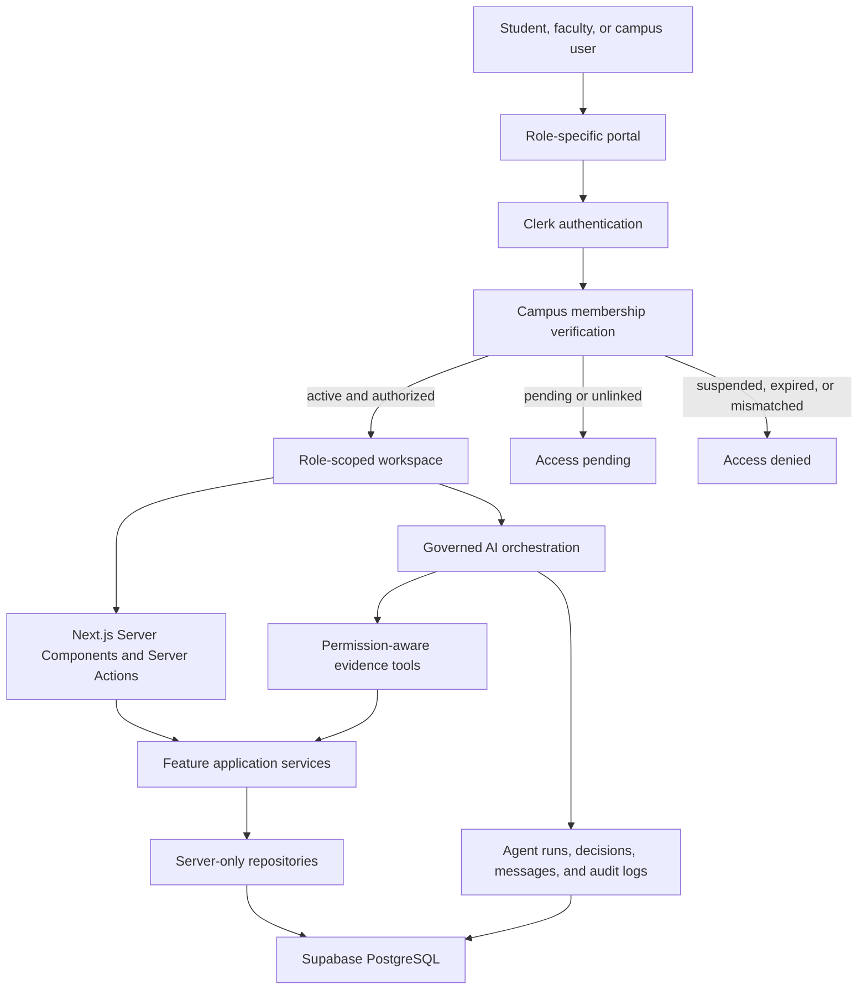

# Aventra AI

Aventra AI is a production-oriented smart campus management platform for students, faculty, maintenance teams, and campus administrators. It brings academic workflows, attendance, scheduling, facilities, analytics, and governed AI decision support into one role-aware application.

The application is built as a modular Next.js monolith with Clerk authentication, Supabase PostgreSQL, server-enforced permissions, audited mutations, and multi-agent workflows powered by the Vercel AI SDK.

## Product overview

Aventra AI replaces fragmented college ERP experiences with focused workspaces for each campus user.

| Portal | Primary users | Capabilities |
| --- | --- | --- |
| Student | Enrolled students | Personal dashboard, attendance visibility, assignments, submissions, notifications, and profile |
| Faculty | Teaching staff | Assigned students and courses, attendance recording, assignments, grading, schedules, reports, and AI assistance |
| Campus | Administrators and operations teams | Institution-wide academics, enrollment, facilities, maintenance, analytics, agents, audit logs, and settings |

Users choose a portal before authentication. After sign-in, the requested portal is checked against the authoritative campus membership stored in Supabase. A user cannot gain access by changing a URL or selecting a different portal.

## Implemented capabilities

- Three distinct portal entry points for students, faculty, and campus teams
- Clerk sign-in, sign-up, session handling, and identity synchronization
- Supabase-backed campus membership lifecycle: `pending`, `active`, `suspended`, and `expired`
- Role- and permission-based workspace navigation
- Student, faculty, department, course, offering, and enrollment administration
- Attendance recording and monitoring
- Assignment creation, student submission, grading, and feedback
- Timetable creation with room, faculty, overlap, and capacity checks
- Classroom, laboratory, and equipment readiness monitoring
- Maintenance ticket creation, assignment, prioritization, SLA tracking, and resolution
- Academic performance and semester-result views
- Notifications, reports, profile, settings, analytics, and audit logs
- Governed coordinator, student-success, classroom, and maintenance agents
- OpenAI and Google Gemini provider support with deterministic fallback
- Human approval for consequential AI recommendations
- Responsive light-theme interface for desktop and mobile

## Architecture



The dependency direction is deliberate:

```text
Routes and presentation
        -> feature application and domain logic
        -> server-only repositories and integrations
        -> Supabase PostgreSQL
```

Pages do not query the database directly. Business rules remain inside their owning feature, and AI tools use the same authorized application paths as the rest of the product.

## Access and authorization model

Authentication answers who the user is. Campus membership and permissions answer what that user may do.

### Roles

| Role | Access summary |
| --- | --- |
| `super-admin` | Full platform access |
| `admin` | Campus administration, academics, operations, agents, reports, and audit access |
| `faculty` | Assigned academic scope, attendance, assignments, grading, reports, and agents |
| `maintenance-staff` | Maintenance operations and operational reports |
| `student` | Personal assignments, submissions, and student workspace |

Authorization is enforced on the server. Hiding a navigation item or button is only a presentation decision and is never treated as a security boundary.

Clerk and Supabase form a two-layer authorization boundary:

- Clerk verifies the session and, when enabled, the active campus Organization, Organization Role, and custom Organization Permissions.
- Supabase remains the authoritative campus directory for role, approval status, validity dates, and academic ownership scope.
- Both layers must approve a protected operation when Clerk Organization permission enforcement is enabled.
- Role changes made by campus administrators are mirrored into Clerk private metadata and can optionally synchronize the Clerk Organization membership.

### Portal flow

1. The user selects Student, Faculty, or Campus on the public site.
2. A new student creates an identity at `/student/sign-up` and completes the academic profile at `/student/onboarding`.
3. Clerk authenticates the user through the matching sign-in route and supplies the verified primary email.
4. The application resolves the Clerk identity to an internal Supabase profile.
5. Student onboarding creates only a pending student record; it cannot self-assign a privileged role or activate membership.
6. A campus administrator verifies the student number, department, and membership before activation.
7. Membership status, role, and requested portal are validated.
8. The user is routed to the correct role workspace or an explicit pending/denied state.
9. Every protected read and mutation performs a server-side permission check.

Faculty data is additionally scoped to assigned course offerings. Student pages are scoped to the signed-in student's own records.

Faculty may approve pending student onboarding requests only within their assigned department. Campus administrators may review all departments. Every approval requires an identity-linked student record, activates only the student role, synchronizes Clerk authorization metadata, and creates an audit event.

## AI multi-agent system

| Agent | Responsibility | Evidence tools |
| --- | --- | --- |
| Coordinator | Combines campus signals and identifies cross-domain exceptions | Attendance, performance, classrooms, schedules, maintenance |
| Student Success | Identifies verified attendance or academic support signals | Attendance and performance |
| Classroom | Evaluates room readiness, capacity, and timetable constraints | Classroom and schedule signals |
| Maintenance | Detects critical or overdue operational work | Maintenance signals |

Agent execution follows these controls:

- Deterministic business rules establish the binding action and review requirement.
- Language models explain and prioritize verified evidence; they do not replace source-of-truth calculations.
- Required tools must run before a provider-generated result is accepted.
- Missing keys, provider failures, or incomplete tool use safely fall back to deterministic output.
- Confidence, evidence, reasons, next actions, provider metadata, and tool usage are persisted.
- Privileged outcomes remain subject to authorized human review.
- Agent runs and decisions produce immutable audit evidence.

## Business rules and safeguards

- Duplicate enrollment is rejected.
- Offering capacity is checked before enrollment.
- Attendance can only be recorded by an authorized user.
- Schedule conflicts include room overlap, faculty overlap, and room capacity.
- Faculty operations are restricted to assigned offerings.
- Students can access and submit only through their personal workspace.
- Memberships that are pending, suspended, expired, or unlinked cannot enter a protected workspace.
- Every mutation validates untrusted input and records an audit event where required.
- Supabase secret credentials are server-only and never exposed through `NEXT_PUBLIC_` variables.
- AI recommendations cannot independently reassign a class, contact a student, approve a decision, or close operational work.

## Technology stack

- Next.js 16 App Router
- React 19 and TypeScript
- Tailwind CSS 4
- Clerk authentication
- Supabase PostgreSQL and JavaScript client
- Vercel AI SDK 7
- OpenAI and Google Gemini providers
- Zod validation
- Framer Motion
- Radix UI foundations
- Lucide icons
- Vitest
- pnpm
- Vercel deployment

## Repository structure

```text
src/
  app/                    Routes, layouts, portal auth, API routes, and workspaces
  ai/                     Agents, tools, contracts, providers, guardrails, and audit persistence
  components/             Shared application and marketing components
  config/                 Navigation and application configuration
  design-system/          Design tokens, primitives, and reusable visual patterns
  features/               Domain-focused business capabilities
  lib/                    Shared framework helpers
  server/                 Auth, authorization, audit, database, and workspace access
  shared/                 Framework-independent shared contracts
  types/                  Generated Supabase database types
supabase/
  migrations/             Ordered SQL schema migrations
  tests/                  Database test location
tests/
  agents/                 Agent evaluation test location
  contract/               Contract test location
  e2e/                    End-to-end test location
  *.test.ts               Unit and policy tests
docs/
  adr/                    Architecture decision records
  architecture/           System architecture documentation
```

## Main routes

### Public and authentication

| Route | Purpose |
| --- | --- |
| `/` | Public landing page and portal selection |
| `/sign-in` | Common portal chooser |
| `/sign-up` | Clerk account creation |
| `/student/sign-in` | Student portal authentication |
| `/student/sign-up` | Student identity registration |
| `/student/onboarding` | Verified student profile submission and approval status |
| `/student-approvals` | Faculty and campus-team review of pending student onboarding |
| `/faculty/sign-in` | Faculty portal authentication |
| `/campus/sign-in` | Campus-team authentication |
| `/app` | Post-authentication portal and membership verification |
| `/access-pending` | Unlinked or pending membership state |
| `/access-denied` | Invalid role, status, or portal access state |

### Protected workspaces

| Route group | Includes |
| --- | --- |
| Personal workspaces | `/student-workspace`, `/faculty-workspace`, `/dashboard` |
| Academics | `/students`, `/faculty`, `/departments`, `/courses`, `/enrollments`, `/assignments`, `/attendance`, `/performance`, `/schedules` |
| Facilities | `/classrooms`, `/laboratories`, `/equipment`, `/maintenance` |
| Intelligence | `/analytics`, `/agents`, `/reports`, `/notifications`, `/audit-logs` |
| Account and administration | `/profile`, `/settings` |

### API routes

| Route | Purpose |
| --- | --- |
| `/api/health` | Service health response |
| `/api/reports/[report]` | Authorized report generation |
| `/api/webhooks/clerk` | Clerk identity synchronization |

## Local development

### Prerequisites

- Node.js 20.9 or newer
- pnpm 11
- A Clerk application
- A Supabase project
- An OpenAI or Gemini API key and model name for provider-backed AI execution

### 1. Install dependencies

```bash
pnpm install
```

### 2. Create the local environment file

```powershell
Copy-Item .env.example .env.local
```

Replace every value ending in `REPLACE_ME`. Never commit `.env.local`.

```dotenv
# Application
NEXT_PUBLIC_APP_URL="http://localhost:3000"

# Clerk
NEXT_PUBLIC_CLERK_PUBLISHABLE_KEY="pk_test_REPLACE_ME"
CLERK_SECRET_KEY="sk_test_REPLACE_ME"
CAMPUS_ADMIN_EMAILS="admin@your-campus.edu"
NEXT_PUBLIC_CLERK_SIGN_IN_URL="/sign-in"
NEXT_PUBLIC_CLERK_SIGN_UP_URL="/sign-up"
NEXT_PUBLIC_CLERK_ORGANIZATIONS_ENABLED="false"
CLERK_CAMPUS_ORGANIZATION_ID="org_REPLACE_ME"
CLERK_SYNC_ORGANIZATION_MEMBERSHIPS="false"
CLERK_ENFORCE_ORGANIZATION_PERMISSIONS="false"
CLERK_WEBHOOK_SIGNING_SECRET="whsec_REPLACE_ME"

# Supabase
NEXT_PUBLIC_SUPABASE_URL="https://your-project-ref.supabase.co"
NEXT_PUBLIC_SUPABASE_PUBLISHABLE_KEY="sb_publishable_REPLACE_ME"
SUPABASE_SECRET_KEY="sb_secret_REPLACE_ME"

# AI
AI_PROVIDER="openai"
OPENAI_API_KEY="sk_REPLACE_ME"
OPENAI_MODEL="your-model-name"
GEMINI_API_KEY="AIza_REPLACE_ME"
GEMINI_MODEL="your-model-name"
```

Only the selected AI provider needs to be configured. If the selected provider is unavailable, Aventra tries the other fully configured provider and otherwise uses deterministic fallback decisions.

### 3. Apply database migrations

Apply every SQL file in `supabase/migrations` in filename order:

1. `202607240001_initial_campus_schema.sql`
2. `202607270001_link_clerk_identities.sql`
3. `202608070001_add_foreign_key_indexes.sql`
4. `202608100001_add_campus_membership_lifecycle.sql`

The migration files are the schema authority. After a schema change, regenerate `src/types/database.ts` from the connected Supabase project.

Row-level security is enabled as a baseline. Public table grants remain restricted; privileged campus workflows use the server-only Supabase secret key after Clerk identity and application permissions have been verified.

### 4. Configure Clerk

In the Clerk dashboard:

1. Copy the publishable and secret keys into `.env.local`.
2. Create a webhook endpoint at `https://YOUR_DOMAIN/api/webhooks/clerk`.
3. Subscribe to `user.created` and `user.updated`.
4. Copy the webhook signing secret into `CLERK_WEBHOOK_SIGNING_SECRET`.
5. Add initial administrator emails to `CAMPUS_ADMIN_EMAILS`.

For Clerk Organizations:

1. Create one Clerk Organization for the campus and copy its ID to `CLERK_CAMPUS_ORGANIZATION_ID`.
2. Keep Clerk's built-in `org:admin` role for campus owners and administrators.
3. Create the custom roles `org:faculty`, `org:student`, and `org:maintenance`.
4. Create custom permissions matching the backend permission keys with the `org:` prefix, such as `org:students:read`, `org:students:approve`, `org:attendance:record`, and `org:campus:manage`, then assign them according to the role matrix above.
5. Set `NEXT_PUBLIC_CLERK_ORGANIZATIONS_ENABLED=true` to show the campus switcher.
6. Set `CLERK_SYNC_ORGANIZATION_MEMBERSHIPS=true` after those roles exist.
7. Set `CLERK_ENFORCE_ORGANIZATION_PERMISSIONS=true` only after all required custom permissions are assigned. Until then, Supabase authorization remains active by itself.

For local webhook testing, expose the local application with a secure tunnel and use that HTTPS URL as the Clerk endpoint.

### 5. Start the application

```bash
pnpm dev
```

Open [http://localhost:3000](http://localhost:3000).

## Commands

| Command | Purpose |
| --- | --- |
| `pnpm dev` | Start the development server |
| `pnpm build` | Create a production build |
| `pnpm start` | Run the production build |
| `pnpm lint` | Run ESLint |
| `pnpm typecheck` | Run TypeScript checks without emitting files |
| `pnpm test` | Run the Vitest suite |
| `pnpm check` | Run lint, typecheck, tests, and production build |

## Verification

Before opening a pull request or deploying, run:

```bash
pnpm check
```

The current automated suite covers permission policy, provider configuration, role navigation, and workspace routing. Production changes should also be verified through the complete browser flow for each portal:

1. Sign in through the intended portal.
2. Confirm role-specific navigation and home routing.
3. Confirm a mismatched portal is rejected.
4. Exercise at least one permitted mutation.
5. Confirm a prohibited mutation is unavailable and rejected server-side.
6. Confirm the resulting source record and audit event.
7. Verify desktop and mobile layouts.

## Deployment on Vercel

1. Import the GitHub repository into Vercel.
2. Set the package manager to pnpm and use the detected Next.js settings.
3. Add every required environment variable for Production and Preview.
4. Set `NEXT_PUBLIC_APP_URL` to the deployed HTTPS origin.
5. Update the Clerk production instance, allowed origins, redirect URLs, and webhook endpoint.
6. Apply Supabase migrations before deploying code that depends on them.
7. Deploy and verify `/api/health`, all three sign-in routes, and each protected role workspace.

When the Vercel project is connected to the GitHub repository, pushes to the configured production branch deploy automatically. Pull requests receive preview deployments.

## Production checklist

- Use Clerk production keys; development keys have strict limits.
- Use HTTPS origins for production authentication and cookies.
- Keep `CLERK_SECRET_KEY`, `CLERK_WEBHOOK_SIGNING_SECRET`, `SUPABASE_SECRET_KEY`, and AI API keys server-only.
- Configure environment variables separately for Development, Preview, and Production.
- Apply and verify all migrations before promotion.
- Confirm administrator email bootstrap values before the first identity sync.
- Review Supabase RLS and grants for every exposed table.
- Validate role, portal, membership status, and academic scope server-side.
- Monitor failed webhooks, agent runs, report generation, and privileged mutations.
- Require human review for consequential agent recommendations.
- Run `pnpm check` and browser verification before release.

## Documentation

- [`docs/architecture/overview.md`](docs/architecture/overview.md)
- [`docs/adr/0001-modular-monolith.md`](docs/adr/0001-modular-monolith.md)
- [`docs/adr/0002-supabase-direct-access.md`](docs/adr/0002-supabase-direct-access.md)
- [`supabase/migrations/README.md`](supabase/migrations/README.md)

## License

This repository is private. No open-source license is granted unless a license file is added explicitly.
