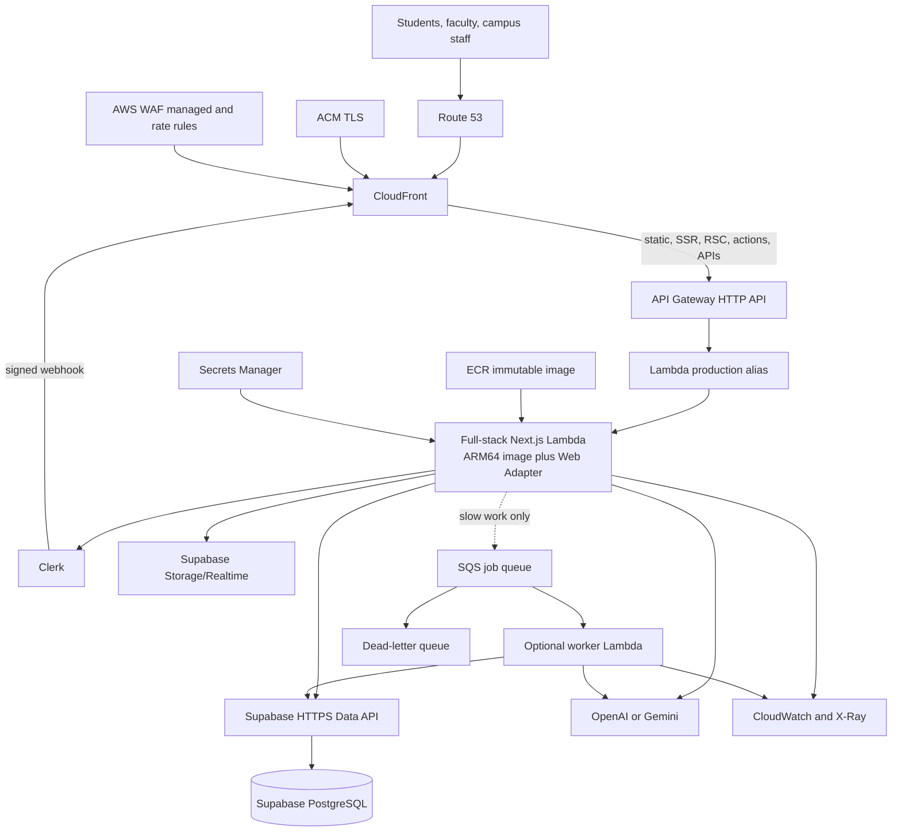
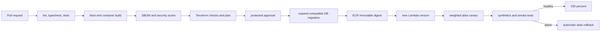

# Aventra AI on AWS Lambda: enterprise production design

**Status:** Proposed reference architecture
**Application:** Next.js 16 full-stack modular monolith
**Identity:** Clerk
**Data platform:** Supabase Data API, PostgreSQL, Storage, and Realtime
**Infrastructure as code:** Terraform

## 1. Executive decision

Deploy Aventra AI as **one versioned full-stack Next.js container image** on AWS
Lambda. The same artifact serves React pages, browser assets, Server Components,
SSR, Server Actions, Route Handlers, Clerk middleware/webhooks, authorization,
Supabase repositories, and bounded synchronous AI work.

This is one application and one web compute tier, not separate frontend and
backend servers. Lambda creates multiple isolated instances of that same image
when traffic grows. Sessions and durable state therefore remain in Clerk and
Supabase.

CloudFront and WAF form the public edge. Uncached requests pass through API
Gateway HTTP API to a Lambda alias. AWS Lambda Web Adapter runs the normal
Next.js standalone HTTP server. Expensive work moves to SQS only when it is too
slow or bursty for an interactive request; that worker is an execution lane, not
a second web backend.

| Goal | Design decision |
| --- | --- |
| Unified frontend/backend | One Next.js standalone image and one web Lambda alias |
| Burst scaling | Lambda concurrency with WAF/API throttles |
| Low idle cost | No EC2, ECS service, ALB, NAT Gateway, or always-on cache |
| Managed identity/data | Clerk identity; Aventra authorization; Supabase data |
| Safe delivery | Image digest, Lambda versions, weighted alias, auto rollback |
| Slow workloads | Durable Supabase job plus optional SQS worker |
| Portability | Standard HTTP container can later move to Fargate |

## 2. Target architecture



## 3. Request and trust flows

### Interactive request

1. Route 53 resolves the production domain to CloudFront.
2. CloudFront terminates TLS and WAF rejects common exploits, oversized requests,
   bots, and abusive route-level rates.
3. CloudFront returns a cached immutable asset when safe. Personalized HTML,
   RSC traffic, Server Actions, API routes, and auth routes are not shared-cache
   candidates.
4. CloudFront adds a rotating origin-verification header. The application
   rejects requests without it, reducing direct API-origin bypass. API Gateway
   throttling remains enabled as an independent protection.
5. API Gateway invokes a published Lambda alias, never `$LATEST`.
6. Lambda Web Adapter forwards the request to the standard Next.js server on
   `127.0.0.1:8080`.
7. Clerk validates identity. Aventra validates membership status, portal, role,
   permission, and academic scope.
8. Server-only repositories call Supabase over HTTPS.

### Mutation invariant

```text
authenticate -> authorize -> validate -> enforce business rule
-> mutate -> write audit evidence -> return minimal result
```

Navigation visibility is not authorization. Every sensitive read and mutation
repeats the server-side check.

### Clerk webhook

`POST /api/webhooks/clerk` is public but must preserve the raw request, verify
`CLERK_WEBHOOK_SIGNING_SECRET`, reject invalid deliveries, claim the event ID
transactionally, process idempotently, and delegate expensive follow-up work to
SQS before returning.

### Slow job

The web request authorizes the operation, creates a job record, enqueues only the
job ID, and returns `202 Accepted`. The worker uses conditional state changes:

```text
requested -> queued -> running -> succeeded
                              -> retryable failure
                              -> terminal failure
```

SQS delivery is at least once. Use idempotency keys, bounded retries, a DLQ, and
no secrets or complete student records in messages.

## 4. Runtime and packaging

Set `output: "standalone"` in `next.config.ts`. After `next build`, copy
`public` and `.next/static` into the standalone tree so one artifact serves the
whole application:

```text
.next/standalone/
  server.js
  public/
  .next/static/
  node_modules/          # traced production subset
```

Start the container with:

```text
HOSTNAME=0.0.0.0 PORT=8080 node server.js
```

The repository Dockerfile packages this layout and installs AWS Lambda Web
Adapter `1.0.1`. Build-time arguments are restricted to browser-visible
`NEXT_PUBLIC_*` configuration. Clerk secret keys, the Supabase secret key, AI
provider keys, and webhook signing keys must be injected only as Lambda runtime
environment variables (preferably through Secrets Manager).

Example build:

```bash
docker build --platform linux/arm64 -t aventra-ai:local \
  --build-arg NEXT_PUBLIC_APP_URL=https://campus.example.edu \
  --build-arg NEXT_PUBLIC_CLERK_PUBLISHABLE_KEY=pk_live_example \
  --build-arg NEXT_PUBLIC_SUPABASE_URL=https://example.supabase.co \
  --build-arg NEXT_PUBLIC_SUPABASE_PUBLISHABLE_KEY=sb_publishable_example \
  .
```

Run the same image locally on `http://localhost:3000`:

```bash
docker run --rm -p 3000:8080 --env-file .env.local aventra-ai:local
```

Use a multi-stage build. Pin the Node base image and Lambda Web Adapter version,
build ARM64, scan it, publish to ECR, and deploy by SHA-256 digest rather than a
mutable tag.

### Initial sizing

| Setting | Development | Staging | Production start |
| --- | ---: | ---: | ---: |
| Memory | 1,024 MB | 1,536 MB | 1,769-2,048 MB |
| Web timeout | 30 s | 45 s | 45 s |
| Ephemeral storage | 512 MB | 512 MB | 512 MB |
| Reserved concurrency | 2-5 | 10-20 | Load-test derived |
| Provisioned concurrency | 0 | 0 | 0 until an SLO proves need |
| Log retention | 7 days | 14 days | 30-90 days by policy |

At 1,769 MB Lambda provides approximately one vCPU. Use Lambda Power Tuning and
load tests: more memory can reduce latency enough to lower total GB-second cost.

### Statelessness and caching

Do not use module memory, `/tmp`, or the Next.js in-memory cache as durable state.
Use Clerk for sessions, Supabase for product/job state, and Supabase Storage for
files. Multiple Lambda instances do not share a Next.js cache.

Initial cache posture:

- CloudFront caches immutable build assets.
- Personalized data remains authoritative in Supabase.
- Runtime ISR/cache persistence is not required for correctness.
- A shared Next.js cache handler is introduced only after a measured need and a
  tested invalidation design.

## 5. Edge and API policy

| CloudFront behavior | Methods | Cache | Forwarding |
| --- | --- | --- | --- |
| `/_next/static/*` | GET/HEAD | 1 year, immutable | No cookies; minimal headers/query |
| Versioned public assets | GET/HEAD | Long TTL | No cookies; minimal headers/query |
| `/_next/image*` | GET/HEAD | Conservative | Validated image parameters only |
| `/api/webhooks/clerk` | POST | Disabled | Signature headers and body |
| `/api/*` | Required methods | Disabled by default | Required headers/cookies/query |
| `/*` | Required methods | Disabled for dynamic routes | Clerk cookies and Next headers |

Never cache personalized HTML or `Set-Cookie` responses. Keep CloudFront cache
policy separate from origin request policy so required cookies can reach Next.js
without accidentally becoming shared-cache content.

Use **HTTP API** initially for cheaper buffered requests. Long AI/report work is
asynchronous. If token streaming is mandatory, evaluate a **Regional REST API
streaming integration** in staging. AWS documents response streaming for REST
APIs, not HTTP APIs; it costs more and must be compatibility-tested with the
pinned Web Adapter. Do not expose a public Function URL merely to gain streaming
without a new security review.

## 6. Capacity and overload management

Estimate concurrency using:

```text
required concurrency ~= peak requests/second x p95 duration in seconds
```

For 100 requests/second at 0.8-second p95, the baseline is about 80 concurrent
executions before a tested margin. Set Lambda reserved concurrency below the
safe combined Clerk, Supabase, and AI-provider capacity.

Protection layers:

- WAF managed rules, IP reputation, body-size rules, and route-specific rates
- API Gateway stage/account throttles
- Lambda reserved concurrency as a hard blast-radius and cost boundary
- short outbound connect/request timeouts
- exponential backoff with jitter only for safe/idempotent calls
- explicit `429`/`503` overload responses
- incident kill switch by setting reserved concurrency to zero

Move work to SQS when it normally exceeds 10-15 seconds, fans out, is bursty,
does not need an immediate answer, has a lower downstream quota, or could
approach Lambda's 15-minute maximum. Use Step Functions for waits, compensation,
or workflows longer than 15 minutes.

## 7. Security design

### Authentication and authorization

- Clerk answers **who**; Aventra permissions answer **what**.
- Supabase membership is authoritative for campus, lifecycle, role, and scope.
- Do not use user-editable metadata for binding authorization.
- Forward `X-Forwarded-Host` and `X-Forwarded-Proto=https` correctly for Clerk.
- Use distinct Clerk instances and keys per environment.

### Supabase

Continue using `@supabase/supabase-js` over the HTTPS Data API, avoiding a native
PostgreSQL connection per Lambda invocation.

- Browser code receives only `sb_publishable_*`.
- Only authorized server repositories receive `sb_secret_*`; it bypasses RLS.
- Prefer a separate secret key per backend component.
- Enable RLS on every exposed table and audit explicit grants.
- Prefer a dedicated exposed API schema and private internal schemas.
- Use `security_invoker` views. Treat `SECURITY DEFINER` as an exception and
  revoke default `PUBLIC` execution.
- Run database security/performance advisors before promotion.

If native PostgreSQL is later required, use Supavisor transaction mode for
serverless traffic, a minimal pool, and no prepared statements when required by
the driver.

### Secrets and IAM

Secrets Manager stores Clerk secret/webhook keys, Supabase secret, AI keys, and
the origin-verification secret. Runtime roles receive read permission for exact
secret ARNs. Never place secret values in Terraform variables, plans, outputs,
state, build arguments, Docker layers, or logs.

GitHub Actions uses OIDC with short-lived credentials. Separate CI plan,
production apply, web runtime, and worker roles. Runtime roles cannot mutate
infrastructure. Production apply requires protected-environment approval.

### Network

Do not VPC-attach Lambda initially. Clerk, Supabase, and AI providers are public
HTTPS services; a VPC adds NAT cost and failure modes without providing a private
path to them. Revisit only when private AWS resources are introduced.

## 8. Reliability and observability

### Proposed starting objectives

| Indicator | Objective requiring owner approval |
| --- | --- |
| Interactive availability | 99.9% monthly |
| Server error rate | Below 0.5% over rolling 5 minutes |
| p95 server duration | Below 1.5 s, excluding deliberate AI generation |
| Clerk webhook completion | 99% within 5 minutes |
| Normal queue age | Below 2 minutes |
| App rollback RTO | Below 60 minutes |
| Data RPO/RTO | Set by selected Supabase backup/PITR tier and restore test |

Emit structured JSON with release, request/trace IDs, route, status, duration,
campus ID, and hashed user reference. Never log tokens, cookies, secrets, raw
signatures, complete student data, or sensitive AI prompts.

Required telemetry and alarms:

- CloudFront requests, cache ratio, origin latency, 4xx/5xx
- WAF block/rate-rule activity
- API Gateway latency, integration latency, throttles, 4xx/5xx
- Lambda duration p50/p95/p99, errors, throttles, concurrency, memory, cold starts
- Supabase/Clerk client latency and errors emitted by Aventra
- queue depth, oldest-message age, retries, and DLQ depth
- AI latency, failures, fallback rate, tokens, and budget limits
- synthetic login, authorized read, denied read, mutation, webhook, and health

Retain known-good image digests and Lambda versions. Test application rollback
and Supabase restore quarterly. Do not claim multi-region availability until the
stateful Supabase tier has a tested regional failover design.

## 9. Release pipeline



- Build once and promote the same digest where practical.
- Use expand/migrate/contract DB compatibility during the canary.
- Start with a 10%/10-minute canary, then tune from real traffic.
- Invalidate only non-versioned CloudFront files.
- Application rollback changes the alias. Database rollback is normally a
  forward repair unless a reversible migration has been tested.

## 10. Terraform design

Preferred account model:

```text
AWS Organization
  security/log archive
  shared services       # state, CI roles, optional shared DNS
  non-production        # development and staging
  production
```

At minimum, separate non-production and production accounts. Use separate Clerk
instances and Supabase projects; never copy production student data without an
approved anonymization process.

```text
infra/
  bootstrap/state/
  modules/
    edge/
    api/
    web-lambda/
    async-jobs/          # optional
    secrets/
    observability/
    budgets/
  environments/
    development/
    staging/
    production/
```

Use explicit environment roots instead of CLI workspaces for production. Store
state in an encrypted, versioned, private S3 bucket with `use_lockfile = true`.
DynamoDB locking is deprecated for the S3 backend and should not be added to a
new design. Restrict production state read access.

Principal resources:

```text
aws_route53_record
aws_acm_certificate / aws_acm_certificate_validation
aws_cloudfront_distribution
aws_cloudfront_cache_policy / aws_cloudfront_origin_request_policy
aws_wafv2_web_acl / aws_wafv2_web_acl_association
aws_apigatewayv2_api / integration / route / stage
aws_ecr_repository / aws_ecr_lifecycle_policy
aws_lambda_function / aws_lambda_alias / aws_lambda_permission
aws_lambda_provisioned_concurrency_config       # only if justified
aws_secretsmanager_secret / aws_kms_key
aws_cloudwatch_log_group / metric_alarm / dashboard
aws_sns_topic
aws_budgets_budget / aws_ce_anomaly_monitor
aws_sqs_queue / aws_lambda_event_source_mapping # optional
aws_scheduler_schedule                          # optional
aws_iam_openid_connect_provider / role / policy
```

## 11. Cost optimization

Defaults: ARM64, HTTP API, zero provisioned concurrency, no NAT/VPC, no
ElastiCache/RDS Proxy/ALB, controlled log retention, immutable ECR lifecycle,
safe CloudFront caching, bounded concurrency, budgets, and anomaly detection.

Planning ranges exclude Clerk, Supabase, AI providers, support, tax, domain
registration, and data transfer to external services:

| Profile | AWS monthly planning range |
| --- | ---: |
| Development | USD 5-20 |
| Staging | USD 20-60 |
| Small production around 1M requests | USD 50-150 |
| Growing production around 10M requests | USD 150-400 |

The main variables are Lambda GB-seconds, CloudWatch ingestion, CloudFront
transfer, WAF requests/rules, and provisioned concurrency. Alert at 50%, 80%, and
100% of budget and on daily anomalies. Track cost per successful request and per
completed agent job.

## 12. Alternatives and exit criteria

| Alternative | Decision | Trigger to reconsider |
| --- | --- | --- |
| Separate SPA and API | Defer | Product intentionally abandons full-stack Next.js server features |
| Public Lambda Function URL | Reject initially | New origin-security review proves controls adequate |
| REST API | Conditional | Token streaming becomes mandatory |
| OpenNext decomposition | Defer | Measured cache/image/runtime limitations justify complexity |
| ECS Fargate | Exit option | Sustained utilization, long requests, WebSockets, or Lambda limitations make it cheaper/better |
| VPC Lambda | Reject initially | Private AWS resources are introduced |
| Active-active regions | Defer | Supabase data failover is designed and tested |

## 13. Production readiness gates

1. All portal, membership, permission, mutation, report, and webhook flows pass.
2. Container/dependency/IaC scans, IAM review, RLS/grant audit, secret scan, WAF
   test, and penetration findings pass policy.
3. Expected peak plus margin, cold/warm latency, concurrency, downstream
   saturation, throttling, and recovery are load-tested.
4. Supabase/Clerk/AI failure, duplicate webhook/job, DLQ, timeout, and rollback
   scenarios are exercised.
5. Dashboards, alarms, runbooks, owners, escalation, synthetics, and budgets are
   active.
6. Application rollback and Supabase restore drills meet accepted RTO/RPO.
7. Student-data classification, retention, deletion, audit, and regional
   requirements are approved.

## 14. Implementation phases

1. **Measure:** select the AWS region near Supabase/users; confirm streaming,
   SLO, traffic, data classification, and budget requirements.
2. **Unified runtime:** standalone image, Web Adapter, ECR, Lambda, HTTP API,
   CloudFront, WAF, ACM, Route 53, secrets, dashboards, and alarms.
3. **Safe delivery:** CI OIDC, migration gate, digest promotion, weighted alias,
   synthetics, and rollback.
4. **Workload isolation:** add SQS/DLQ only for proven slow/bursty operations.
5. **Evidence-based tuning:** memory, concurrency, timeouts, cache, WAF, log
   sampling, provisioned concurrency, REST streaming, and Lambda/Fargate choice.

## 15. Repository-specific prerequisites

1. Change the Node engine from 20 to 22 or later; current Supabase client
   releases have dropped Node 20 support.
2. Add `output: "standalone"` to `next.config.ts`.
3. Preserve `src/proxy.ts`; Next.js 16 uses `proxy`, and Clerk needs correct
   forwarded host/protocol behavior.
4. Keep privileged Supabase clients in server-only modules.
5. Review every route for duration, response size, streaming, and file writes.
6. Add a release identifier to health output and logs.
7. Add durable Clerk event idempotency before enabling production webhooks.

## 16. Primary references

- AWS Well-Architected Serverless Lens: <https://docs.aws.amazon.com/wellarchitected/latest/serverless-applications-lens/welcome.html>
- Lambda best practices: <https://docs.aws.amazon.com/lambda/latest/dg/best-practices.html>
- Lambda quotas: <https://docs.aws.amazon.com/lambda/latest/dg/gettingstarted-limits.html>
- Lambda resilience: <https://docs.aws.amazon.com/lambda/latest/dg/security-resilience.html>
- AWS Lambda Web Adapter: <https://github.com/aws/aws-lambda-web-adapter>
- API Gateway response streaming: <https://docs.aws.amazon.com/apigateway/latest/developerguide/response-transfer-mode.html>
- CloudFront cache policies: <https://docs.aws.amazon.com/AmazonCloudFront/latest/DeveloperGuide/cache-key-understand-cache-policy.html>
- Terraform S3 backend: <https://developer.hashicorp.com/terraform/language/backend/s3>
- Clerk production deployment: <https://clerk.com/docs/guides/development/deployment/production>
- Clerk behind a proxy: <https://clerk.com/docs/guides/development/deployment/behind-a-proxy>
- Clerk webhook verification: <https://clerk.com/docs/reference/backend/verify-webhook>
- Supabase API security: <https://supabase.com/docs/guides/api/securing-your-api>
- Supabase API keys: <https://supabase.com/docs/guides/getting-started/api-keys>
- Supabase serverless connections: <https://supabase.com/docs/guides/database/connecting-to-postgres>
